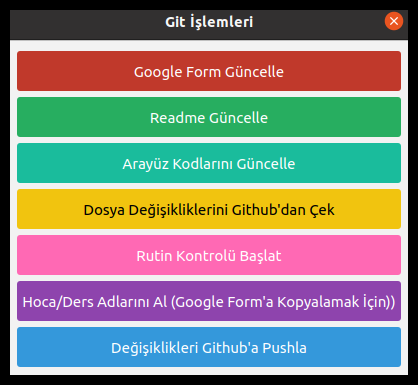

# Üniversite Ders Notları Readme Oluşturucu

Bu reponun amacı temel olarak herhangi bir üniversitenin herhangi bir bölümündeki öğrencilerin oluşturduğu ders notları reposuna readme oluşturma işini kolaylaştırmaktır.

## Gereksinimleri İndirme 📦

Projeyi başarıyla çalıştırabilmek için aşağıdaki adımları izleyerek gerekli kütüphaneleri ve bağımlılıkları yükleyiniz:

1. **Python 3 Kurulumu:** Projeyi çalıştırmak için Python 3'ün bilgisayarınızda yüklü olması gerekmektedir. Python'ı [buradan](https://www.python.org/downloads/) indirebilirsiniz (linux için `sudo apt install python3`). Kurulum tamamlandıktan sonra terminali açın ve `python3 --version` komutu ile kurulumun başarılı olduğunu doğrulayın. 🐍

1. **Pip3 Kurulumu:** Pip, Python paketlerini yönetmek için kullanılan bir araçtır. Python 3 ile birlikte genellikle otomatik olarak yüklenir. Kurulumunu doğrulamak için terminali açın ve `pip3 --version` komutunu çalıştırın. Eğer kurulu değilse, [Pip'in resmi belgelerini](https://pip.pypa.io/en/stable/installing/) takip ederek kurulum yapabilirsiniz.(linux için `sudo apt install python3-pip`) 🛠️

1. **Gerekli Kütüphanelerin Yüklenmesi:** Projede kullanılan kütüphaneleri yüklemek için, terminalinize `pip3 install -r gereksinimler.txt` komutunu girin. Bu komut, `gereksinimler.txt` dosyasında listelenen tüm paketleri yükleyecektir. 📚

## Nasıl Kullanılır

Proje dosyaları arasında, hocalar, dersler, dönemler ve diğer bilgileri içeren JSON formatında çeşitli dosyalar bulunmaktadır. Bu dosyalar, projenin çeşitli yerlerinde kullanılarak dinamik bir içerik oluşturur.

Örneğin:

- `hocalar.json` hoca bilgilerini içerir ve README'leri oluşturmakta kullanılır.
- `dersler.json` ders bilgilerini tutar.
- `donemler.json` dönem bilgilerini tutar.
- `giris.json` README dosyasının giriş bilgilerini içerir.

Bu dosyalarla birlikte, her dersin ve her dönemin klasöründe README dosyaları oluşturulur.

### Arayüzü Çalıştırmak

Bu bölümde, projenin arayüzünün nasıl çalıştırılacağı adım adım açıklanmaktadır.

#### json_depo_bilgileri.txt Dosyasının Hazırlanması:

    Projede, `json_depo_bilgileri.txt` dosyasının kök dizinde olması gerekmektedir. Bu dosya yoksa, arayüz tarafından otomatik olarak oluşturulur. Dosya, JSON dosyalarının hangi klasörde tutulacağını belirtir. Örneğin:

    ```
    ..
    YTU_Bilgisayar_Muhendisligi_Arsiv
    json_dosyalari
    ```

    Bu yapıya göre, JSON dosyaları `YTU_Bilgisayar_Muhendisligi_Arsiv/json_dosyalari` klasöründe oluşur.

#### Konfigürasyon Dosyasının Oluşturulması

    `json_depo_bilgileri.txt` dosyasında belirtilen yolda `konfigurasyon.json` dosyası oluşturulmalıdır. Bu dosya yoksa, arayüz tarafından otomatik olarak oluşturulur. Dosyanın içeriği aşağıdaki gibi olmalıdır:

    ```json
    {
      "github_url": "https://github.com/baselkelziye/YTU_Bilgisayar_Muhendisligi_Arsiv",
      "hoca_yorumlama": "https://forms.gle/WbwDxHUz6ebJA7t36",
      "hoca_oylama": "https://forms.gle/s6ZMrQG4q578pEzm7",
      "ders_yorumlama": "https://forms.gle/SzNmK1w4rVaKE4ee8",
      "ders_oylama": "https://forms.gle/3njZjmhm215YCAxe6",
      "ders_oylama_csv": "https://docs.google.com/spreadsheets/d/e/2PACX-1vSDFicOFbJu9Fnc4Hl0mFuuaC0L4PiEmUFkkJrgocwWGWs1wB3TyN1zd4okW8svC6IT2HMIe64NQUUy/pub?output=csv",
      "ders_yorumlama_csv": "https://docs.google.com/spreadsheets/d/e/2PACX-1vQvGyGLQxobIpaVdQItSpqEoiwJ0DIIHE9kVvCHhfKQ7yYR16c2tI_ix4Z9d2tA4aLt2c4fTLGxlL-s/pub?output=csv",
      "hoca_oylama_csv": "https://docs.google.com/spreadsheets/d/1w386auUiJaGwoUAmmkEgDtIRSeUplmDz0AZkM09xPTk/export?format=csv",
      "hoca_yorumlama_csv": "https://docs.google.com/spreadsheets/d/1mexaMdOeB-hWLVP4MI_xmnKwGBuwoRDk6gY9zXDycyI/export?format=csv",
      "dokumanlar_repo_yolu": "..",
      "cikmislar": "https://drive.google.com/drive/folders/1LI_Bo7kWqI2krHTw0noUFl9crfZSlrZh"
    }
    ```

    - `github_url`: Bu anahtarın karşısına ders dökümanlarının tutulduğu GitHub reposunun adresini ekleyin.
    - `hoca_yorumlama`: Bu anahtara, hoca yorumlamak için oluşturulan Google Form anketinin linkini ekleyin. Eğer anket henüz oluşturulmadıysa, soru tipleri ve sıralaması [bu örnektekiyle](https://forms.gle/WbwDxHUz6ebJA7t36) birebir aynı olmalıdır.
    - `hoca_oylama`: Bu anahtara, hoca oylamak için oluşturulan Google Form anketinin linkini ekleyin. Eğer anket henüz oluşturulmadıysa, soru tipleri ve sıralaması [bu örnektekiyle](https://forms.gle/s6ZMrQG4q578pEzm7) birebir aynı olmalıdır.
    - `ders_yorumlama`: Bu anahtara, ders yorumlamak için oluşturulan Google Form anketinin linkini ekleyin. Eğer anket henüz oluşturulmadıysa, soru tipleri ve sıralaması [bu örnektekiyle](https://forms.gle/SzNmK1w4rVaKE4ee8) birebir aynı olmalıdır.
    - `ders_oylama`: Bu anahtara, ders oylamak için oluşturulan Google Form anketinin linkini ekleyin. Eğer anket henüz oluşturulmadıysa, soru tipleri ve sıralaması [bu örnektekiyle](https://forms.gle/3njZjmhm215YCAxe6) birebir aynı olmalıdır.
    - `ders_oylama_csv`: Bu anahtara, ders oylamak için oluşturulan Google Form anketinin içeriğinin kaydedildiği dosyanın CSV formatındaki linkini ekleyin.
    - `ders_yorumlama_csv`: Bu anahtara, ders yorumlamak için oluşturulan Google Form anketinin içeriğinin kaydedildiği dosyanın CSV formatındaki linkini ekleyin.
    - `hoca_oylama_csv`: Bu anahtara, hoca oylamak için oluşturulan Google Form anketinin içeriğinin kaydedildiği dosyanın CSV formatındaki linkini ekleyin.
    - `ders_yorumlama_csv`: Bu anahtara, hoca yorumlamak için oluşturulan Google Form anketinin içeriğinin kaydedildiği dosyanın CSV formatındaki linkini ekleyin.
    - `dokumanlar_repo_yolu`: Bu anahtara, göreceli olarak ders dökümanlarının tutulduğu GitHub reposunun yolunu verin. Örneğin, `../..` olarak belirlenirse, `README.md` dosyaları iki üst dizini kök dizin olarak kabul eder.
    - `cikmislar`: İsteğe bağlı olarak boş bırakılabilir. Ders notlarının vb. tutulduğu herhangi bir dış kaynak linki varsa bu alana ekleyebilirsiniz.

    **Not:** Google Sheets'ten CSV dosyasını nasıl linke dönüştüreceğinizi bilmiyorsanız, [bu adresteki](https://blog.golayer.io/google-sheets/export-google-sheets-to-csv) `Export Google Sheets to CSV Automatically` başlığına göz atabilirsiniz.

#### Arayüzün Çalıştırılması

Yukarıdaki dosyalar hazırlandıktan sonra, Windows'ta arayüzü çalıştırmak için `arayuz.bat` dosyası açılmalıdır. Arayüz ekranlarının anlatımları:

##### Ana Sayfa Ekranı

<a id="arayuz_ana_sayfa"></a>

<p align="center">
    
    <br>
    <strong>Ana Sayfa Ekranı</strong>
</p>

1. _Giriş Güncelle Butonu_

   - Bu buton ders dökümanları reposunun kök dizinindeki _README.md_ dosyasının **_Giriş_** kısmını manipüle edebilen ekranı açar. [Ana Sayfa Ekranı](#ana-sayfa-ekranı)'nda 1 numaralı butona karşılık gelmektedir.

<a id="readme_giris_ornek"></a>

<p align="center">
    
    <br>
    <strong>README.md Giriş Örneği</strong>
</p>

- [README.md Giriş Örneği](#readme_giris_ornek)'ndeki _İçindekiler_, _Başlık_ ve _Başlık Açıklaması_ kısımları bu [Giriş Güncelle Ekranından](#giris_guncelle_ekrani) düzenlenebilir.

1.  _Repo Kullanımı Düzenle Butonu_

    - Bu buton ders dökümanları reposunun kök dizinindeki _README.md_ dosyasının **_Repo Kullanımı_** kısmını manipüle edebilen ekranı açar. [Ana Sayfa Ekranı](#ana-sayfa-ekranı)'nda 2 numaralı butona karşılık gelmektedir. - [README.md Repo Kullanımı Örneği](#readme_repo_kullanimi_ornek)'ndeki _Açıklamalar_, _Talimatlar_ ve _Kavramlar_ kısımları bu [Repo Kullanımı Düzenle Ekranından](#repo_kullanimi_ekrani) düzenlenebilir.

    <a id="readme_repo_kullanimi_ornek"></a>

    <p align="center">
        
        <br>
        <strong>README.md Repo Kullanımı Örneği</strong>
    </p>

1.  _Ders Ekle/Güncelle Butonu_

    - Bu buton ders dökümanları reposunun kök dizinindeki _README.md_ dosyasının **_Dersler_** kısmını manipüle edebilen ekranı açar. Aynı zamanda her **dönem klasörü** ve **ders klasörü** içindeki _README.md_ dosyalarının içeriğini de etkiler.[Ana Sayfa Ekranı](#ana-sayfa-ekranı)'nda 3 numaralı butona karşılık gelmektedir. - [README.md Ders Ekle/Güncelle Kök Dosyası Örneği](#readme_ders_ekle_guncelle_ornek)'ndeki _Dersler'in_, _Ders Tipi_, _Ders Adı_ ve _Dersi Yürüten Akademisyenler_ kısımları - [README.md Ders Ekle/Güncelle Dönem Dosyası Örneği](#readme_ders_ekle_guncelle_donem_ornek) ve [README.md Ders Ekle/Güncelle Ders Dosyası Örneği](#readme_ders_ekle_guncelle_ders_ornek)'ndeki _Yıl_, _Dönem_, _Ders Tipi_ ve _Faydalı Olabilecek Kaynaklar_ kısımları [Ders Ekle/Güncelle Ekranından](#ders_ekle_guncelle_ekrani) düzenlenebilir.
    <a id="readme_ders_ekle_guncelle_ornek"></a>
    <p align="center">
        
        <br>
        <strong>README.md Ders Ekle/Güncelle Kök Dosyası Örneği</strong>
    </p>
    <a id="readme_ders_ekle_guncelle_donem_ornek"></a>
    <p align="center">
        
        <br>
        <strong>README.md Ders Ekle/Güncelle Dönem Dosyası Örneği</strong>
    </p>
    <a id="readme_ders_ekle_guncelle_ders_ornek"></a>
    <p align="center">
        
        <br>
        <strong>README.md Ders Ekle/Güncelle Ders Dosyası Örneği</strong>
    </p>

1.  _Hoca Ekle/Güncelle Butonu_

    - Bu buton ders dökümanları reposunun kök dizinindeki _README.md_ dosyasının **Hocalar** kısmını manipüle edebilen ekranı açar. [Ana Sayfa Ekranı](#ana-sayfa-ekranı)'nda 4 numaralı butona karşılık gelmektedir. - [README.md Hoca Ekle Güncelle Örneği](#readme_hoca_ekle_guncelle_ornek)'ndeki _Hoca Adı_, _Araştırma Sayfası_, _Ofis_, _Verdiği Dersler_ kısımları bu [Hoca Ekle/Güncelle Ekranından](#hoca_ekle_guncelle_ekrani) düzenlenebilir.

    <a id="readme_hoca_ekle_guncelle_ornek"></a>
    <p align="center">
    
    <br>
    <strong>README.md Hoca Ekle/Güncelle Örneği</strong>
    </p>

    1.  _Yazarın Notları Ekle/Güncelle Butonu_

        - Bu buton ders dökümanları reposunun kök dizinindeki _README.md_ dosyasının **Yazarın Notları** kısmını manipüle edebilen ekranı açar. [Ana Sayfa Ekranı](#ana-sayfa-ekranı)'nda 5 numaralı butona karşılık gelmektedir. - [README.md Yazarın Notları Ekle Güncelle Örneği](#readme_yazarin_notlari_ekle_guncelle_ornek)'ndeki _Yazarın Notları_ kısmı bu [Yazarın Notları Ekle/Güncelle Ekranından](#yazarin_notlari_ekle_guncelle_ekrani) düzenlenebilir.

        <p align="center">
        
        <br>
        <strong>README.md Yazarın Notları Ekle/Güncelle Örneği</strong>
        </p>

    1.  _Katkıda Bulunan Ekle/Güncelle Butonu_

        - Bu buton ders dökümanları reposunun kök dizinindeki _README.md_ dosyasının **Katkıda Bulunanlar** kısmını manipüle edebilen ekranı açar. [Ana Sayfa Ekranı](#ana-sayfa-ekranı)'nda 6 numaralı butona karşılık gelmektedir. - [README.md Katkıda Bulunan Ekle Güncelle Örneği](#readme_katkida_bulunan_ekle_guncelle_ornek)'ndeki _Katkıda Bulunanlar_ kısmı bu [Katkıda Bulunan Ekle/Güncelle Ekranından](#katkida_bulunanlar_ekle_guncelle_ekrani) düzenlenebilir.

    <a id="readme_katkida_bulunan_ekle_guncelle_ornek"></a>
    <p align="center">
    
    <br>
    <strong>README.md Katkıda Bulunan Ekle/Güncelle Örneği</strong>
    </p>

    1. _Dönem Ekle/Güncelle Butonu_

       - Bu buton ders dökümanları reposunun kök dizinindeki _README.md_ dosyasının **Dönemler** kısmını aynı zamanda her dönem klasörü içindeki README.md dosyalarının içeriğini de etkileyen ekranı açar. [Ana Sayfa Ekranı](#ana-sayfa-ekranı)'nda 7 numaralı butona karşılık gelmektedir. - [README.md Ders Ekle/Güncelle Kök Dosyası Örneği](#readme_ders_ekle_guncelle_ornek)'ndeki _Dönem Adı_ kısmı - [README.md Ders Ekle/Güncelle Dönem Dosyası Örneği](#readme_ders_ekle_guncelle_donem_ornek)'ndeki _Dönem Adı_ ve _Genel Tabsiyeler_ kısmı [Dönem Ekle/Güncelle Ekranından](#donem_ekle_guncelle_ekrani) düzenlenebilir.

    1. _Git İşlemleri Butonu_

       - Bu buton yapılan değişiklikleri githuba gönderme gibi işleri yapabildiğimiz ekranı açar.
       - Eğer anketlerde bir değişiklik varsa değişiklikleri json dosyalarına uygulayan _Google Forum Güncelleme_ işlemi
       - Json dosyalarındaki her türlü değişikliği _README.md_ dosyalarına uygulayan _Readme Güncelleme_ işlemi
       - Bu arayzle alakalı herhangi bir değişiklik varsa _Arayüz Kodlarını Güncelleme_ işlemi
       - Ders dosyalarında herhangi bir değişiklik varsa _Dosya Değişikliklerini Github'dan Çekme_ işlemi
       - Anketlerdeki değişiklikleri otomatik ve periyodik olarak githubla senkronize etmek için _Rutin Kontrolü Başlatma_ işlemi
       - Ders dosyalarıyla alakalı yaptığımız tüm _Değişiklikleri Github'a Pushlama_ işlemi [Git İşlemleri Ekranından]() yapılabilir.

#### Giriş Güncelle Ekranı

<a id="giris_guncelle_ekrani"></a>

<p align="center">
    
    <br>
    <strong>Giriş Güncelle Ekranı</strong>
</p>

1. _Başlık Düzenle Butonu_

   - Bu buton _Giriş_ alanının başlığını düzenlemeye yarayan [Giriş Başlık Düzenleme]() ekranını açar.

1. _Açıklama Düzenle Butonu_

   - Bu buton _Giriş_ alanının açıklamasını düzenlemeye yarayan [Giriş Açıklama Düzenleme]() ekranını açar.

1. _İçindekiler Ekle Butonu_

   - Bu buton _Giriş_ alanının içindekiler kısmını düzenlemeye yarayan [İçindekiler Ekle]() ekranını açar.

1. _İçindekiler İçinde Yer Alan Herhangi Bir Buton_

   - Bu buton _Giriş_ alanının ilgili içeriğini düzenlemeye yarayan [İçindekiler Düzenle]() ekranını açar.

#### Repo Kullanımı Düzenle Ekranı

<a id="repo_kullanimi_ekrani"></a>

<p align="center">
    
    <br>
    <strong>Repo Kullanımı Düzenleme Ekranı</strong>
</p>

1. _Başlık Düzenle Butonu_

   - Bu buton _Repo Kullanımı_ alanının başlığını düzenlemeye yarayan [Repo Kullanımı Başlık Düzenleme]() ekranını açar.

1. _Talimat Ekle Düzenle Butonu_

   - Bu buton _Repo Kullanımı_ alanının talimatlarını düzenlemeye yarayan [Talimat Ekle/Düzenle]() ekranını açar.

1. _Kavram Ekle Düzenle Butonu_

   - Bu buton _Repo Kullanımı_ alanının kavramlarını düzenlemeye yarayan [Kavram Ekle/Düzenle]() ekranını açar.

1. Açıklama Ekle Düzenle Butonu\_

   - Bu buton _Repo Kullanımı_ alanının açıklamalarını düzenlemeye yarayan [Açıklama Ekle/Düzenle]() ekranını açar.

#### Ders Ekle/Güncelle Ekranı

<a id="ders_ekle_guncelle_ekrani"></a>

<p align="center">
    
    <br>
    <strong>Ders Ekle Güncelle Ekranı</strong>
</p>

1. _Bölüm Adı Düzenle Butonu_

   - Bu buton _Dersler_ bölümünün adını düzenlemeye yarayan [Dersler Bölüm Adı Düzenleme](#ders_ekrani_baslik_duzenle) ekranını açar.

1. _Açıklama Düzenle Butonu_

   - Bu buton _Dersler_ bölümünün açıklamasını düzenlemeye yarayan [Dersler Açıklama Düzenleme](#ders_ekrani_aciklama_duzenle) ekranını açar.

1. _Ders Ekle Butonu_

   - Bu buton _Dersler_ bölümündeki dersler arasına ders eklemeyi sağlayan [Ders Ekleme](#ders_ekrani_ders_ekle) ekranını açar.

1. _Dersler İçinde Yer Alan Ders Adını İçeren Buton_

   - Bu buton _Dersler_ bölümündeki ilgili dersi düzenlemeye yarayan [Ders Düzenleme](#ders_ekrani_ders_duzenle) ekranını açar.

1. _Dersler İçinde Yer Alan Ders Adının Karşısındaki Kaynak Ekle/Güncelle Butonu_

   - Bu buton _Dersler_ bölümündeki ilgili dersin kaynaklarını düzenlemeye yarayan [Kaynak Ekle/Güncelle](#ders_ekrani_kaynak_ekrani) ekranını açar.

1. _Dersler İçinde Yer Alan Ders Adının Karşısındaki Öneri Ekle/Güncelle Butonu_

   - Bu buton _Dersler_ bölümündeki ilgili dersin önerilerini düzenlemeye yarayan [Öneri Ekle/Güncelle](#ders_ekrani_oneri_ekrani) ekranını açar.

#### Hoca Ekle/Güncelle Ekranı

<a id="hoca_ekle_guncelle_ekrani"></a>

<p align="center">
    
    <br>
    <strong>Hoca Ekle Güncelle Ekranı</strong>
</p>

1. _Bölüm Adı Düzenle Butonu_

   - Bu buton _Hocalar_ bölümünün adını düzenlemeye yarayan [Hocalar Bölüm Adı Düzenleme]() ekranını açar.

1. _Açıklama Düzenle Butonu_

   - Bu buton _Hocalar_ bölümünün açıklamasını düzenlemeye yarayan [Hocalar Açıklama Düzenleme]() ekranını açar.

1. Hocalar Ekle Butonu\_

   - Bu buton _Hocalar_ bölümündeki hocalar arasına yeni hoca eklemeyi sağlayan [Hoca Ekleme]() ekranını açar.

1. _Hocalar İçinde Yer Alan Herhangi Bir Buton_

   - Bu buton _Hocalar_ bölümündeki ilgili hocayı düzenlemeye yarayan [Hoca Düzenleme]() ekranını açar.

#### Yazarın Notları Ekle/Güncelle Ekranı

<a id="yazarin_notlari_ekle_guncelle_ekrani"></a>

<p align="center">
    
    <br>
    <strong>Yazarın Notları Ekle Güncelle Ekranı</strong>
</p>
1. _Başlık Düzenle Butonu_

- Bu buton _Yazarın Notları_ alanının başlığını düzenlemeye yarayan [Yazarın Notları Başlık Düzenleme]() ekranını açar.

1. _Not Ekle Butonu_

   - Bu buton _Yazarın Notları_ alanının notları arasına yeni not eklemeye yarayan [Yazarın Notları Not Ekle]() ekranını açar.

1. _Notlar İçinde Yer Alan Herhangi Bir Buton_

   - Bu buton _Yazarın Notları_ bölümündeki ilgili notu düzenlemeye yarayan [Yazarın Notları Not Düzenleme]() ekranını açar.

#### Katkıda Bulunanlar Ekle/Güncelle Ekranı

<a id="katkida_bulunanlar_ekle_guncelle_ekrani"></a>

<p align="center">
    
    <br>
    <strong>Katkıda Bulunanlar Ekle Güncelle Ekranı</strong>
</p>

1. _Bölüm Adı Düzenle Butonu_

   - Bu buton _Katkıda Bulunanlar_ alanının bölüm adını düzenlemeye yarayan [Katkıda Bulunanlar Bölüm Adı Düzenleme]() ekranını açar.

1. _Bölüm Açıklaması Düzenle Butonu_

   - Bu buton _Katkıda Bulunanlar_ bölümünün açıklamasını düzenlemeye yarayan [Katkıda Bulunanlar Bölüm Açıklaması Düzenleme]() ekranını açar.

1. _Katkıda Bulunan Ekle Butonu_

   - Bu buton _Katkıda Bulunanlar_ alanının katkıda bulunanları arasına yeni katkıda bulunan eklemeye yarayan [Katkıda Bulunanlar Katkıda Bulunan Ekle]() ekranını açar.

1. _Katkıda Bulunanlar İçinde Yer Alan Herhangi Bir Buton_

   - Bu buton _Katkıda Bulunanlar_ bölümündeki ilgili katkıda bulunanı düzenlemeye yarayan [Katkıda Bulunanlar Katkıda Bulunan Düzenleme]() ekranını açar.

#### Dönem Ekle/Güncelle Ekranı

<a id="donem_ekle_guncelle_ekrani"></a>

<p align="center">
    
    <br>
    <strong>Dönem Ekle Güncelle Ekranı</strong>
</p>

1. _Dönem Ekle Butonu_

   - Bu buton _Dönemler_ alanının dönemleri arasına yeni dönem bulunan eklemeye yarayan [Dönemler Dönem Ekle/Düzenle](#donem_ekle_guncelle_ekrani_donem_duzenleme) ekranını açar.

1. _Dönemler İçinde Yer Alan Herhangi Bir Buton_

   - Bu buton _Dönemler_ bölümündeki ilgili dönemi düzenlemeye yarayan [Dönemler Dönem Ekle/Düzenle](#donem_ekle_guncelle_ekrani_donem_duzenleme) ekranını açar.

#### Git İşlemleri Ekranı

<a id="git_islemleri_ekrani"></a>

<p align="center">
    
    <br>
    <strong>Git İşlemleri Ekranı</strong>
</p>

1. _Google Form Güncelle Butonu_

   - Bu buton güncel anket verilerini çeker.

1. _Readme Güncelle Butonu_
   - Bu buton _json dosyalarının_ son haline göre tüm **_README.md_** dosyalarını oluşturur.
1. _Arayüz Kodlarını Güncelle Butonu_
   - Bu buton arayüz kodlarının en güncel halini githubdan çeker.
1. _Dosya Değişikliklerini Githubdan Çek Butonu_
   - Bu buton eğer bilgisayardaki dosyalarda herhangi bir değişiklik yoksa githubdaki ders notları vb.'de olan değişiklikleri yerele çeker.
1. _Rutin Kontrol Başlat Butonu_
   - Bu buton sürekli bir kontrol başlatır. Anketlere herhangi bir cevap gelip gelmediğini sürekli kontrol eder. Eğer anketlerden herhangi birine cevap gelmişse değişiklikleri işler. İlk olarak _Google Form Güncelle Butonu_'nun işlevini gerçekleştirir. Daha sonra _Readme Güncelle Butonu_'nun işlevlerini gerçekleştirir. Sonra da değişiklikleri github'a pushlar.
1. _Değişiklikleri Github'a Pushla_
   - Bu buton yereldeki ders reposundaki tüm değişiklikleri githuba göndermeye yarayan [Değişiklikleri Pushlama]() ekranını açar.

#### Dersler Açıklama Düzenleme

<a id="ders_ekrani_aciklama_duzenle"></a>

<p align="center">
    
    <br>
    <strong>Dersler Açıklama Düzenleme Ekranı</strong>
</p>

1. _Bölüm Açıklamasını Giriniz_
   - Değiştirilmek istenen _Bölüm Açıklaması_ buraya girilir ve _**OK**_ butonuna basılıp kaydedilir.

#### Dersler Bölüm Adı Düzenleme

<a id="ders_ekrani_baslik_duzenle"></a>

<p align="center">
    
    <br>
    <strong>Dersler Bölüm Adı Düzenleme Ekranı</strong>
</p>

1. _Bölüm Adını Giriniz_
   - Değiştirilmek istenen _Bölüm Adı_ buraya girilir ve _**OK**_ butonuna basılıp kaydedilir.

#### Ders Düzenleme

<a id="ders_ekrani_ders_duzenle"></a>

<p align="center">
    
    <br>
    <strong>Ders Düzenleme Ekranı</strong>
</p>

1. _Ders Adı_
   - Dersin adı buraya girilir.
2. _Yıl_
   - Dersin yılı buraya girilir.
3. _Dönem_
   - Dersin dönemi seçilir.
4. _Ders Güncel Mi?_
   - Ders şu an güncel müfredatta varsa _**True**_ yoksa _**False**_ seçilir.
5. _Tip_
   - Dersin tipi buradan seçilir.
6. _Dersi Veren Hoca Ekle Butonu_
   - Dersi veren hoca eklemek için bu buton kullanılır. Sonrasında _Dersi Veren Hocalar_'a gelen seçme alanından hocanın adı seçilir.
7. _Değişiklikleri Kaydet_
   - Yapılan değişiklikler eğer kaydedilmek isteniyorsa bu buton kullanılmalıdır.
8. _Dersi Sil_
   - Eğer ders silinmek isteniyorsa bu buton kullanılmalıdır.

#### Ders Ekleme

<a id="ders_ekrani_ders_ekle"></a>

<p align="center">
    
    <br>
    <strong>Ders Ekleme Ekranı</strong>
</p>

1. _Ders Adı_
   - Dersin adı buraya girilir.
2. _Yıl_
   - Dersin yılı buraya girilir.
3. _Dönem_
   - Dersin dönemi seçilir.
4. _Ders Güncel Mi?_
   - Ders şu an güncel müfredatta varsa _**True**_ yoksa _**False**_ seçilir.
5. _Tip_
   - Dersin tipi buradan seçilir.
6. _Dersi Veren Hoca Ekle Butonu_
   - Dersi veren hoca eklemek için bu buton kullanılır. Sonrasında _Dersi Veren Hocalar_'a gelen seçme alanından hocanın adı seçilir.
7. _Ekle_
   - Yapılan değişiklikler eğer kaydedilmek isteniyorsa bu buton kullanılmalıdır.

#### Kaynak Ekle/Güncelle

<a id="ders_ekrani_kaynak_ekrani"></a>

<p align="center">
    
    <br>
    <strong>Kaynak Ekle/Güncelle Ekranı</strong>
</p>

1. _Ekle_
   - Bu buton _Dersler_ bölümündeki ilgili derse kaynak eklemeye yarayan [Dersler Kaynak Ekleme]() ekranını açar.
1. _Kaynaklar İçinde Yer Alan Herhangi Bir Buton_

   - Bu buton _Dersler_ bölümündeki ilgili dersin ilgili kaynağını düzenlemeye yarayan [Dersler Kaynak Düzenleme]() ekranını açar.

#### Öneri Ekle/Güncelle

<a id="ders_ekrani_oneri_ekrani"></a>

<p align="center">
    
    <br>
    <strong>Öneri Ekle/Güncelle Ekranı</strong>
</p>

1. _Ekle_
   - Bu buton _Dersler_ bölümündeki ilgili derse öneri eklemeye yarayan [Dersler Öneri Ekleme/Düzenleme](#ders_ekrani_oneri_ekrani_ekle) ekranını açar.
1. _Öneriler İçinde Yer Alan Herhangi Bir Buton_

   - Bu buton _Dersler_ bölümündeki ilgili dersin ilgili önerisini düzenlemeye yarayan [Dersler Öneri Ekleme/Düzenleme](#ders_ekrani_oneri_ekrani_ekle) ekranını açar.

#### Dersler Öneri Ekleme/Düzenleme

<a id="ders_ekrani_oneri_ekrani_ekle"></a>

<p align="center">
    
    <br>
    <strong>Dersler Öneri Ekleme/Düzenleme Ekranı</strong>
</p>

1. _Öneri Sahibi_
   - Öneri sahibinin _**adı/nicki**_'ni buraya yazmalısın.
1. _Öneri_
   - Dersle ilgili önerini buraya yazmalısın.
1. _Kaydet Butonu_
   - Yapılan değişiklikleri kaydetmek için bu butonu kullanmalısın.

#### Dönemler Dönem Ekle/Düzenle

<a id="donem_ekle_guncelle_ekrani_donem_duzenleme"></a>

<p align="center">
    
    <br>
    <strong>Dönemler Dönem Ekle/Düzenle Ekranı</strong>
</p>

1. _Dönem Adı_
   - Dönem'in _**README.md**_'de gözükecek adı.
1. _Yıl_
   - Dönemin ait olduğu yıl.
1. _Dönem_
   - Dönemin ait olduğu dönem.
1. _Genel Tavsiye Ekle_
   - Tavsiyeler arasına bir yenisini ekler. Silmek için yanındaki **_Sil_** butonuna tıklayabilirsin.
1. _Kaydet Butonu_
   - Kaydetmeye yarayan buton.
